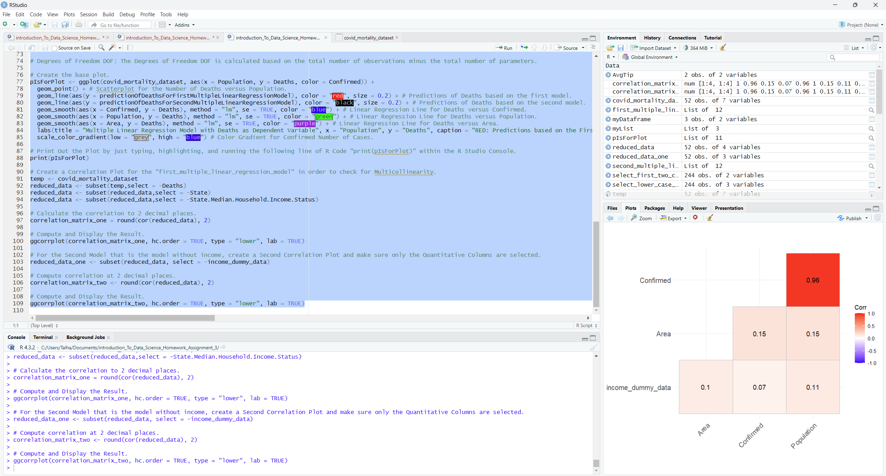
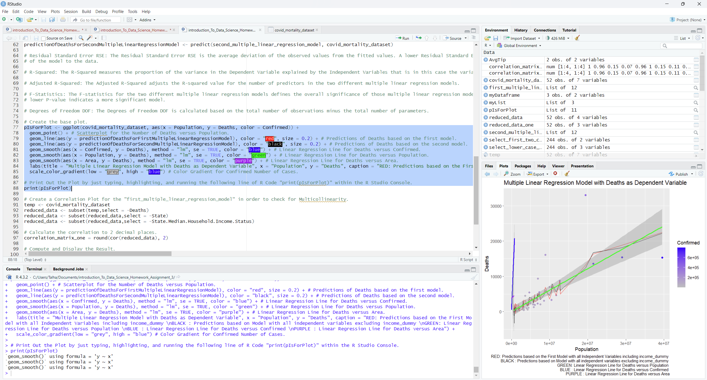
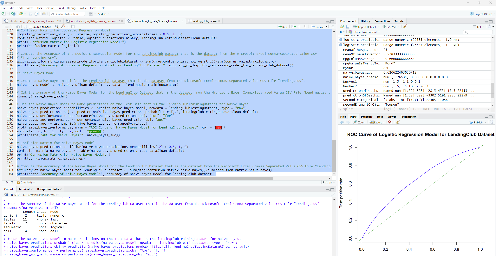

# README to Know More About the Multiple Linear Regression Model And Logistic Regression Model And Naive Bayes Classifier Model

## Important Details:
I trained two linear regression models to predict COVID-19 mortality rate based on population statistics. Additionally, I trained a Naïve Bayes classifier to predict whether an individual will
default on a loan using finance-based features. For each model, I computed evaluation metrics and plotted results.

## Website Instruction References for Downloading R and RStudio on Microsoft Windows, Mac, MacOS, and Linux Operating Systems:
1. https://www.youtube.com/watch?v=H9EBlFDGG4k
2. https://www.youtube.com/watch?v=I5WIMX4LK8M
3. https://www.youtube.com/watch?v=eE1zh0YVMeM

## Instructions for Running `introduction_To_Data_Science_Homework_Assignment_3_CovidMortality_Part1.R` Code in RStudio:

1. Based on the Screenshot Image shown below, to run the R Source Code File `introduction_To_Data_Science_Homework_Assignment_3_CovidMortality_Part1.R`, first, Left-Click your computer mouse and highlight the entire code.
   
   
   
2. Second, press the Green Right Arrow "Run" Button on top and on the right of the RStudio Source Pane. As a result, the R Program `introduction_To_Data_Science_Homework_Assignment_3_CovidMortality_Part1.R` outputs a Correlation Matrix.
  
3. Third, Left-Click your computer mouse again and highlight lines 77 to 88 in the R Source Code File `introduction_To_Data_Science_Homework_Assignment_3_CovidMortality_Part1.R`.
   
4. Then, press the Green Right Arrow "Run" Button again on the top and on the right of the RStudio Source Pane. As a result, the R Program `introduction_To_Data_Science_Homework_Assignment_3_CovidMoratlity_Part1.R` outputs the plot
   for the "Multiple Linear Regression Model with Deaths as Dependent Variable" as shown in the Screenshot Image below.
   
   

## Instructions for Running `introduction_To_Data_Science_Homework_Assignment_3_LendingClub_Part_2.R` Code in RStudio:

1. Based on the Screenshot Image shown below, to run the R Source Code File `introduction_To_Data_Science_Homework_Assignment_3_CovidMortality_Part2.R`, first, Left-Click your computer mouse and highlight the entire code.

2. Second, press the Green Right Arrow "Run" Button on top and on the right of the RStudio Source Pane. As a result, the R Program `introduction_To_Data_Science_Homework_Assignment_3_Covid_Mortality_Part2.R` outputs a "ROC Curve of
   Logistic Regression Model for Lending Club Dataset".

   

